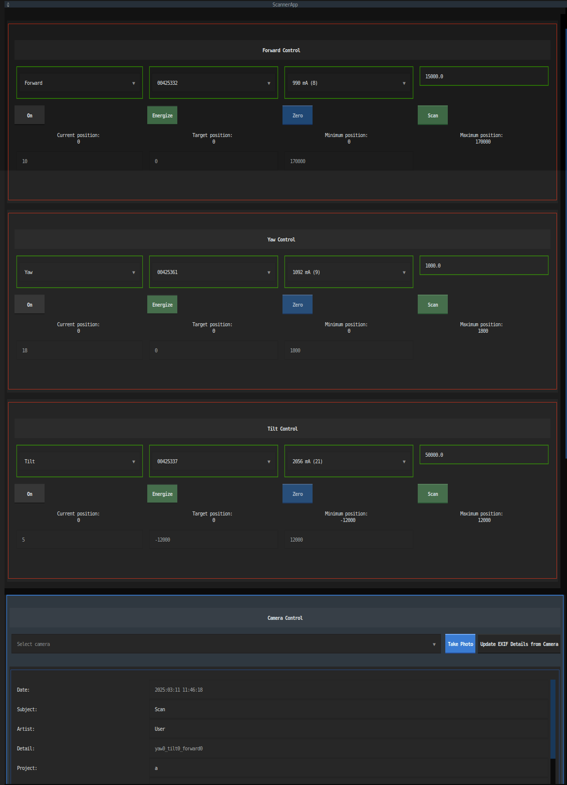

## Scant-TUI

ScAnt Terminal User Interface

A simplified version of the scAnt GUI, for use on an Ubuntu-based system. Runs directly in the terminal. Tested on Ubuntu 20.04 LTS.

## Screenshot



### Installation, Ubuntu

1. Install the dependencies:
```
sudo apt install python3 python3-pip
```
2. Install these packages into a new virtual environment:
```bash
python3 -m venv venv
source venv/bin/activate
pip3 install gphoto2 --only-binary :all:
pip3 install pyusb ticlib textual textual-dev textual[syntax] textual-slider Pillow imageio rawpy ticlib 
```
3. Install the Ubuntu drivers for Stepper motor controllers ([reference](https://www.pololu.com/product/3134/resources))
```bash
cd bin
tar -xf pololu-tic-1.8.1-linux-x86.tar.xz # Unzip the pololu-tic-1.8.1-linux-x86.tar.xz
cd pololu-tic-1.8.1-linux-x86 # The instructions, inside the README.txt are repeated here
sudo ./install.sh
cd ../..
ticcmd -h # Confirm that the installation worked
```
4. Install gphoto2 CLI ([reference](https://sourceforge.net/projects/gphoto/files/gphoto/2.5.28/gphoto2-2.5.28.tar.xz/download))
```bash
sudo apt install gphoto2
gphoto2 --auto-detect # Confirm that the installation worked
```
5. Add the current user to the group that can access the USB ports:
```bash
sudo adduser $USER dialout
sudo adduser $USER plugdev
```

### Configuration

#### WSL notes

In addition to the below *Configure devices* section, WSL users can try:

1. Install win-usbipd via Powershell Windows Package Manager, then run ([reference](https://github.com/dorssel/usbipd-win)):
```powershell
winget install usbipd
usbipd list # Confirm the USB devices are plugged in and visible on the Windows Host e.g 3-1    1ffb:00bd  Pololu Tic T500 Not Shared
usbipd bind --busid=<BUSID> # Do this for each Pololu Tic T500 USB devices and the Canon camera, may require administrator Powershell, until they are 'Shared'
usbipd attach --wsl --busid=<BUSID> # Do this for each Pololu Tic T500 and Canon camera
```

#### Configure devices

1. Plug-in the Pololu Tic500 stepper motors via USB or USB hub, and confirm they are detected by the system:
```bash
ticcmd --list
```
2. Plug-in the Canon camera via USB or USB hub, and confirm it is detected by the system:
```bash
gphoto2 --auto-detect
```

These should return information about the devices (names of stepper motors and Canon camera). To test these within the Python environment:

3. Confirm that Python, USB, camera, stepper motors are working:
```bash
python3 examples/test_gphoto2_camera_capture.py
python3 examples/test_gphoto2_camera_info.py
python3 examples/test_libtic.py
```

### Usage

Simply run:

```bash
python3 scripts/main.py
```

For development run:

```bash
textual console -x SYSTEM -x EVENT -x DEBUG -x INFO # textual console -v for verbose logs
textual run --dev scripts/main.py
```

### Notes

- Current limit settings: https://www.pololu.com/docs/0J71/6#setting-current-limit
- Maximum current limit for Tic T500 for the Pitch/ Yaw servo is 2131 mA.
- Others are uncertain, believed to be 1000 mA.

Ranges for stepper motors:

- Tilt: 10 positions, -15000 to 12000 with middle zeroing, speed 15000
- Yaw: 18 positions,0 to 1800 with no zeroing, speed 1000
- Forward: 0 to 170000 with middle zeroing, speed 50000


### Polarized Light setup

1. Place the polarized light filter on the camera lens
2. Place the circular polarizer filter on the ring flash
3. Inside the live camera preview, place a clear glass cup or similar object with reflections so it's visible in the live view
4. Rotate the circular polarizer filter until the reflections in the glass are eliminated (or significantly reduced, in my setup they were much smaller and more of a dark blue colour)

### Results

1st attempt at complete scan:

Time to take 10 photos across 10 positions of10000 position units (-5000 to 5000) of Forward axis movement at default speed: 33 seconds
Time to take 180 photos across 18 positions of 1800 position units of Yaw axis movement at default speed: 1644 seconds (27.4 minutes) = 1.0GB
Time to take 900 photos across 5 positions of -2000 position units of Tilt axis movement at default speed: 8220 seconds (2 hours 17 minutes) = 4.9GB

#### Camera polarization filter image examples

All below images were taken with the same settings:

F-stop: 22
ISO: 100
Focus: manually adjusted using reference focus highlighting (focus peaking) on the color calibration target
Flash: Godox Wistro AR400
Flash Trigger: via hotshoed flashsync mounted on top of Canon Camera, channel 11, 2.4GHz, via X2T-C Godox trigger, with High Speed Sync (HSS) enabled on the Canon camera menu
Flash Receiver: to XTR16 plugged in via USB of Godox Wistro AR400 ring flash


**Unpolarized example**
Flash Power: 1/128 power
Light Polarization Filter: none
Lens Polarization Filter: none
Lens: Canon 35mm macro


**Linear polarization example**
Flash Power: 1/4 power
Light Polarization Filter: ScanSpace polarized light filter for Godox Wistro AR400 ring flash, mounted with handle pointing upwards
Lens Polarization Filter: unpolarized
Lens: Canon 35mm macro


**Cross polarization example**
Flash Power: 1/4 power
Light Polarization Filter: ScanSpace polarized light filter for Godox Wistro AR400 ring flash, mounted with handle pointing upwards
Lens Polarization Filter: angled with words 'CANON' at an angle of about 45 degrees clockwise from pointing upwards as looking in the same direction as the lens
Lens: Canon 35mm macro


**Cross polarization example**
Flash Power: 1/4 power
Light Polarization Filter: ScanSpace polarized light filter for Godox Wistro AR400 ring flash, mounted with handle pointing upwards
Lens Polarization Filter: angled with words 'CANON' at an angle of about 45 degrees clockwise from pointing upwards as looking in the same direction as the lens
Lens: Laowa 65mm macro


